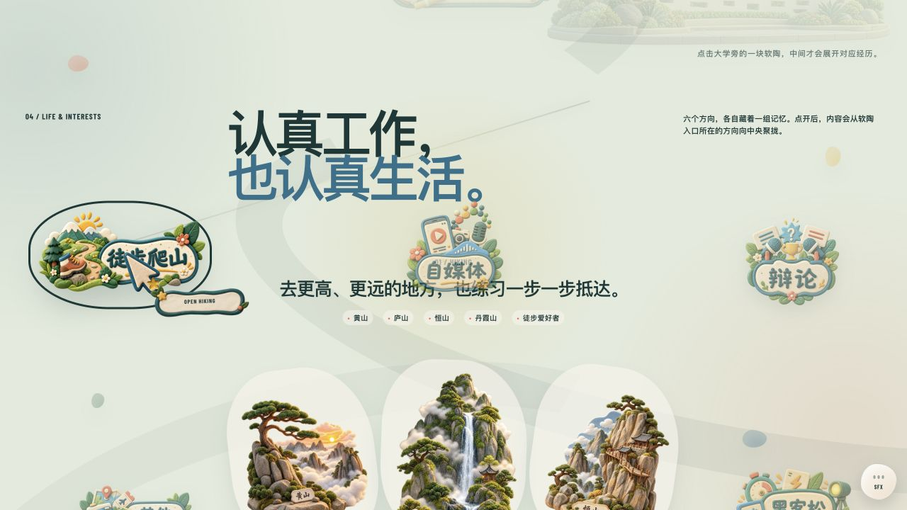

# Violet Xie Portfolio

Violet 的个人作品集网站，记录 AI 解决方案、企业交付经历、教育经历与生活兴趣。

[打开在线 Demo](https://violetloveai.github.io/#life)



> 当前为公开参考版。页面结构与交互来自个人网站当前版本，业务截图、客户名称和使用者信息已做脱敏处理。

## 网站内容

- 6 个作品入口：跨境经营舱、企服智诊、启衡智审、课时簿、Final Human 与其他构建
- 4 段职业能力路径：交付管理、实施顾问、应用支持、AI 解决方案实践
- 教育、校园活动、生活兴趣与联系方式
- 可展开的作品、职业、教育和 Life 卡片，以及独立案例页

## 技术栈

- Next.js 16 与 React 19
- GSAP 与 ScrollTrigger
- Tailwind CSS 4
- Next.js 静态导出
- GitHub Actions 与 GitHub Pages

## 本地运行

需要 Node.js 22 或更高版本。

```bash
npm install
npm run dev
```

打开 `http://localhost:3000`。

## 质量检查

```bash
npm run lint
npm run build
```

构建结果位于 `out/`，GitHub Actions 会在 `main` 分支更新后自动部署。

## 公开版本说明

公开仓库不包含真实经营数据、ERP 导出截图或活动现场人物照片。相关案例使用脱敏文案、演示数据或原创黏土风格插画呈现。案例中的第三方品牌与商标归各自权利人所有。

## 使用权

本仓库没有开源许可证。代码、文字、肖像、插画和图片素材仅供浏览与作品参考；公开访问不代表授予复制、修改、再发布或商业使用权。如需引用或合作，请先联系作者。
